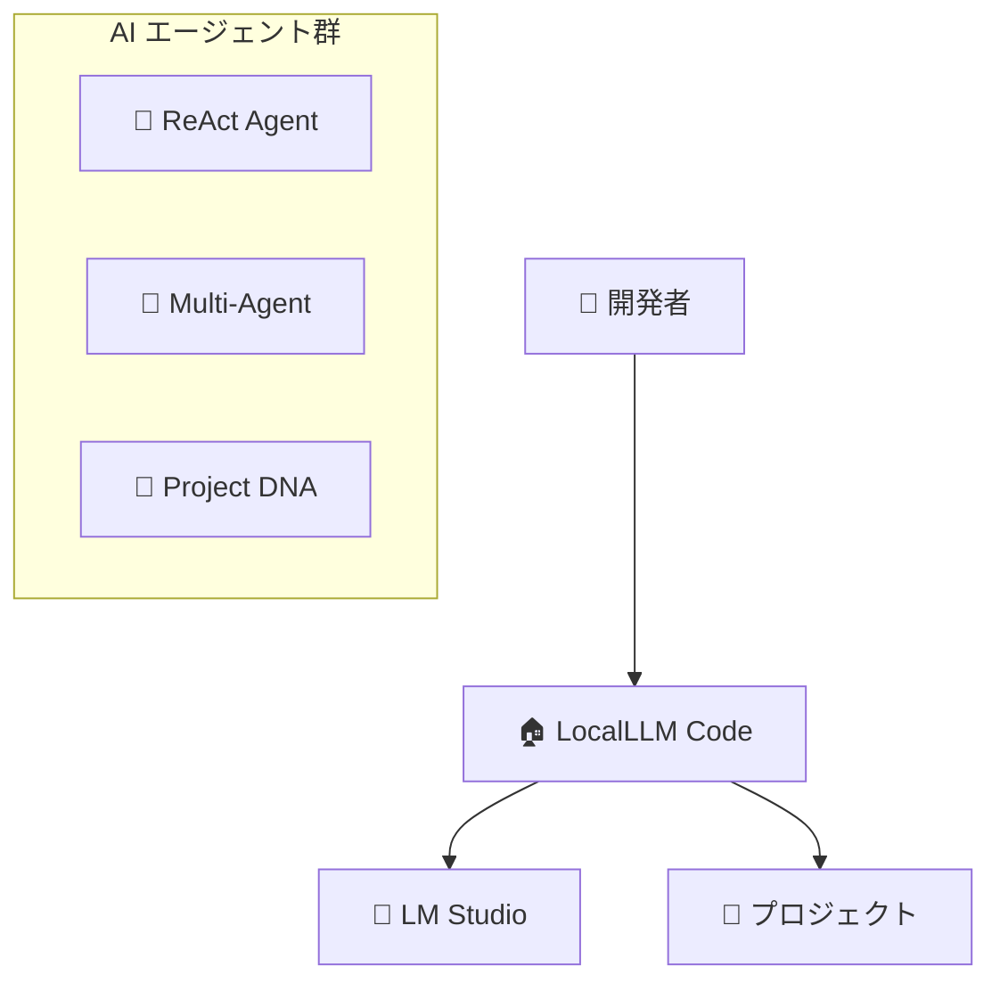

# LocalLLM Code - アプリ紹介文章と説明スライド情報

## 📱 アプリ紹介文章

### LocalLLM Code - 次世代AI開発アシスタント

**ローカルLLMの力を最大限に活用する、革新的なエージェント型開発支援ツール**

LocalLLM Code は、開発者の創造性と生産性を飛躍的に向上させる、新しい形のAI開発アシスタントです。Claude Code の思想を受け継ぎながら、ローカル環境での完全な制御とプライバシーを実現し、さらに高度なマルチエージェント協調システムを搭載しています。

### 🌟 なぜLocalLLM Codeを選ぶのか？

#### **完全なプライバシー保護**
あなたのコードは外部に送信されません。LM Studio を使用したローカル実行により、企業の機密情報や個人のプロジェクトを完全に保護します。オフライン環境でも動作し、インターネット接続が不安定な環境でも安心して使用できます。

#### **革新的なReActエージェント**
人間の思考プロセスを模倣した「思考→行動→観察」のループにより、複雑な開発タスクを自律的に実行します。単純な質問応答を超え、プロジェクト全体を理解し、最適な解決策を段階的に構築していきます。

#### **三人文殊の知恵 - マルチエージェント協議**
日本の諺「三人寄れば文殊の知恵」からインスパイアされた独自のマルチエージェントシステム。慎重派・積極派・判定役の3つの異なる視点から問題を分析し、複雑な技術的決定において最適解を導き出します。

#### **プロジェクトDNA解析**
あなたのプロジェクトを深く理解し、使用されている言語、フレームワーク、アーキテクチャパターン、コーディングスタイルを自動学習。この「プロジェクトDNA」により、一貫性のあるコードの提案と、プロジェクト固有の最適化を実現します。

#### **スマートコンテキスト管理**
限られたコンテキストウィンドウを最大限活用するため、ファイルの関連性を自動評価し、重要な情報を優先的に保持。大規模プロジェクトでも効率的に作業できます。

#### **堅牢な安全設計**
多層防御システムにより、破壊的操作を事前に検出・防止。自動バックアップ、危険コマンドフィルタリング、ユーザー確認プロンプトなど、包括的な安全機能でプロジェクトを守ります。

### 🎯 こんな方におすすめ

- **企業開発者**: 機密情報を外部に送信せずにAI支援を受けたい
- **個人開発者**: プライベートプロジェクトでAIの力を活用したい
- **学習者**: AIとの対話を通じて開発スキルを向上させたい
- **チーム**: 一貫したコーディングスタイルとベストプラクティスを維持したい
- **研究者**: 最新のAI技術を開発ワークフローに統合したい

### 🚀 今すぐ始めよう

1. **簡単セットアップ**: LM Studio をインストールし、LocalLLM Code を起動
2. **プロジェクト解析**: 自動的にプロジェクト構造とパターンを学習
3. **自然言語で対話**: 「認証機能を追加したい」「このバグを修正して」など、自然な日本語で指示
4. **AI が自動実行**: ReActループにより、思考・実行・検証を自動で繰り返し、最適解を提供

LocalLLM Code は、AI と開発者の理想的なパートナーシップを実現します。あなたの創造性を制限するのではなく、技術的な作業を自動化し、より重要な設計と意思決定に集中できる環境を提供します。

---

## 🎨 説明スライド作成情報

### スライド構成案（20-25枚想定）

#### **1. タイトルスライド**
```
LocalLLM Code
次世代AI開発アシスタント
- ローカルLLMによる完全プライバシー保護
- マルチエージェント協調システム
- ReActループによる自律的タスク実行
```

#### **2. 問題提起スライド**
```
現在の開発者が直面する課題
❌ コードの外部送信によるセキュリティリスク
❌ 単発の質問応答に留まるAI支援
❌ プロジェクト理解不足による非適切な提案
❌ 複雑なタスクでの思考プロセス不透明性
❌ 一貫性のないコードスタイルとアーキテクチャ
```

#### **3. ソリューション概要**
```
LocalLLM Code が解決する価値
✅ 完全ローカル実行 - ゼロデータ流出
✅ ReActエージェント - 自律的思考プロセス  
✅ プロジェクトDNA - 深いコンテキスト理解
✅ マルチエージェント - 複数視点による最適化
✅ 安全設計 - 破壊的操作の自動防止
```

#### **4. システムアーキテクチャ概要**


#### **5. ReActエージェント詳細**
```
Think (思考) → Act (行動) → Observe (観察)

🤔 Think: 現状分析と行動計画立案
⚡ Act: ツールを使用した実際の作業実行
👀 Observe: 結果の観察と学習
🔄 Loop: 目標達成まで自動繰り返し
```

#### **6. マルチエージェント協議システム**
```
三人文殊の知恵 (Three Wise Agents)

🛡️ 慎重派エージェント
   → リスク評価・安全性チェック

🚀 積極派エージェント  
   → 最適化・効率性提案

⚖️ 判定エージェント
   → バランス評価・最終判断

👑 親分エージェント
   → 複雑問題の上級判断
```

#### **7. プロジェクトDNA機能**
```
自動プロジェクト理解システム

🔍 言語・フレームワーク検出
📐 アーキテクチャパターン分析
✍️ コーディングスタイル学習
🧬 プロジェクト固有DNA生成
💾 LOCALLLM.md による記憶保持
```

#### **8. 安全設計の特徴**
```
多層防御セキュリティ

🔒 入力検証・サニタイゼーション
🛡️ パストラバーサル攻撃防止
⚠️ 危険コマンド自動フィルタリング
💾 実行前自動バックアップ作成
👤 破壊的操作での確認プロンプト
📝 全操作の詳細ログ記録
```

#### **9. ユースケース - Web開発**
```
実例: React + Node.js プロジェクト

入力: "ユーザー認証機能を追加したい"

ReActプロセス:
1. 🤔 既存アーキテクチャ分析
2. ⚡ JWT実装パターン提案
3. 👀 セキュリティリスク評価
4. 🔄 マルチエージェント協議
5. ✅ 最適な実装パスの提示
```

#### **10. ユースケース - データ分析**
```
実例: Python + Pandas プロジェクト

入力: "売上データの可視化を改善したい"

自動実行:
- データ構造の理解
- 既存可視化コードの分析
- より効果的なグラフライブラリの提案
- インタラクティブ要素の追加提案
- パフォーマンス最適化の実装
```

#### **11. 技術スタック**
```
コア技術
🐍 Python 3.11+ (非同期処理)
🎨 Rich (高度なターミナルUI)
🔌 aiohttp (非同期LLM通信)
⚙️ TOML (階層的設定管理)

対応LLMプロバイダー
🏠 LM Studio (主要・ローカル)
☁️ Azure ChatGPT (クラウド対応)
🔷 Google Gemini (将来対応)
```

#### **12. セットアップの簡単さ**
```
3ステップで開始

1️⃣ LM Studio インストール・起動
   → 好みのローカルモデル選択

2️⃣ LocalLLM Code クローン・実行
   → python main.py

3️⃣ プロジェクトフォルダーで対話開始
   → 自動プロジェクト解析実行
```

#### **13. 主要コマンド例**
```
自然言語インターフェース

"ファイル構造を分析して" 
→ プロジェクト全体の構造把握

"テストを追加したい"
→ 既存コードに最適なテスト作成

"パフォーマンスを改善して"
→ ボトルネック検出・最適化提案

"このバグを修正して"  
→ エラー原因分析・修正実装
```

#### **14. 国際化対応**
```
多言語サポート

🇯🇵 日本語 (プライマリー)
   → 詳細メッセージ・エラー説明

🇺🇸 English (フォールバック)
   → 基本的なインターフェース

🔄 動的言語切り替え
   → ランタイムでの言語変更対応
```

#### **15. パフォーマンス特徴**
```
効率的動作

⚡ 非同期処理による高速応答
💾 スマートキャッシュシステム
🗜️ 自動コンテキスト圧縮
🎯 関連ファイル優先ロード
📊 リアルタイムトークン監視
```

#### **16. 拡張性設計**
```
将来への対応

🔌 プラグインアーキテクチャ
📦 新ツールの動的追加
🌐 新LLMプロバイダー統合
🎛️ カスタム設定対応
🧪 実験的機能フラグ
```

#### **17. 競合比較**
```
| 特徴 | LocalLLM Code | Claude Code | GitHub Copilot |
|------|---------------|-------------|----------------|
| プライバシー | 🟢 完全ローカル | 🟡 クラウド | 🔴 データ送信 |
| 自律性 | 🟢 ReActループ | 🟡 対話型 | 🔴 補完のみ |
| プロジェクト理解 | 🟢 DNA分析 | 🟡 基本 | 🔴 限定的 |
| マルチエージェント | 🟢 三人文殊 | 🔴 単一 | 🔴 単一 |
| 安全性 | 🟢 多層防御 | 🟡 基本 | 🟡 基本 |
```

#### **18. 導入メリット**
```
組織・個人への価値

🏢 企業
- 機密情報の完全保護
- 一貫したコーディング標準
- 開発効率の大幅向上

👤 個人開発者  
- 学習効果の最大化
- コード品質の向上
- 創造的作業への集中

🎓 学習者
- AIとの対話学習
- ベストプラクティス習得
- 実践的スキル向上
```

#### **19. ロードマップ**
```
今後の開発計画

🔜 短期 (3-6ヶ月)
- GUI インターフェース
- 追加LLMプロバイダー対応
- プラグインシステム拡充

🎯 中期 (6-12ヶ月)  
- クラウド協調機能
- チーム共有機能
- CI/CD パイプライン統合

🚀 長期 (1年+)
- AI学習・適応機能
- 企業システム統合
- 自動リファクタリング
```

#### **20. デモ・実演**
```
ライブデモシナリオ

1️⃣ 新規Reactプロジェクトの解析
2️⃣ "TODOアプリを作成して" 指示
3️⃣ ReActプロセスのリアルタイム表示
4️⃣ マルチエージェント協議の可視化
5️⃣ 自動生成コードの確認
6️⃣ 安全機能の動作確認
```

#### **21. コミュニティ・サポート**
```
開発コミュニティ

📖 包括的ドキュメント
🐛 GitHub Issues サポート
💬 コミュニティディスカッション
🎥 チュートリアル動画
📝 開発ブログ
🤝 コントリビューション歓迎
```

#### **22. まとめ**
```
LocalLLM Code が実現する未来

🔮 AI開発アシスタントの新しい標準
🛡️ プライバシーを守りながらAIの恩恵を享受
🧠 人間とAIの理想的なコラボレーション
🚀 開発生産性の飛躍的向上
🌟 すべての開発者がアクセス可能なAI支援

今すぐ始めて、開発の未来を体験しよう！
```

#### **23. Q&A準備**
```
想定質問と回答

Q: セットアップにどの程度時間がかかりますか？
A: LM Studio含めて15-20分程度で完了します

Q: 大規模プロジェクトでも動作しますか？
A: スマートコンテキスト管理により効率的に処理可能

Q: 日本語以外でも使用できますか？
A: 英語でも使用可能、将来的に多言語対応予定

Q: 商用利用は可能ですか？
A: オープンソースライセンスで商用利用可能

Q: カスタマイズできますか？
A: 設定ファイルとプラグインで幅広くカスタマイズ可能
```

---

## 🎯 プレゼンテーション Tips

### **効果的な説明のポイント**

1. **ライブデモを重視**: 実際の動作を見せることで理解度が大幅に向上
2. **プライバシー重視**: 企業・個人の関心事である セキュリティを強調
3. **具体的ユースケース**: 抽象的説明より実例が効果的
4. **競合との差別化**: 既存ツールとの明確な違いを示す
5. **将来性アピール**: 継続的な開発・改善計画を提示

### **デモ用サンプルプロジェクト**
- **React TODO アプリ**: 分かりやすい例で機能説明
- **データ分析プロジェクト**: Python/Pandasでの科学的応用
- **API サーバー**: Node.js/Express での実用的例

### **視覚的要素の活用**
- **Mermaid図**: アーキテクチャの直感的理解
- **スクリーンショット**: 実際のインターフェース表示
- **動画**: ReActループの動作過程
- **比較表**: 競合との機能比較

この情報を基に、聴衆の技術レベルと関心に応じてスライドを調整し、効果的なプレゼンテーションを作成できます。