# LocalLLM Code アーキテクチャ図

## 1. システム全体アーキテクチャ

### 1.1 高レベルアーキテクチャ

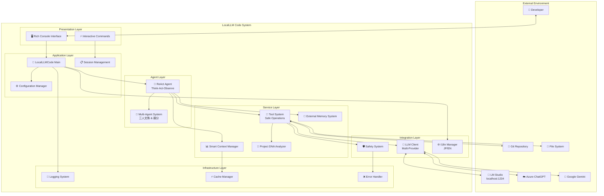

## 2. データフローアーキテクチャ

### 2.1 情報処理フロー

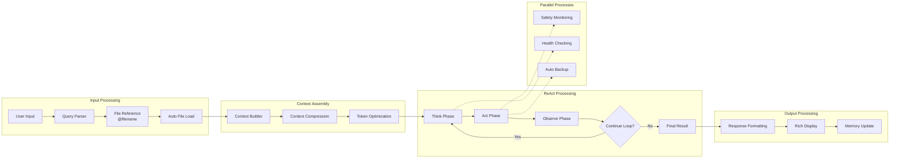

## 3. ReActエージェント詳細アーキテクチャ

### 3.1 ReActループアーキテクチャ

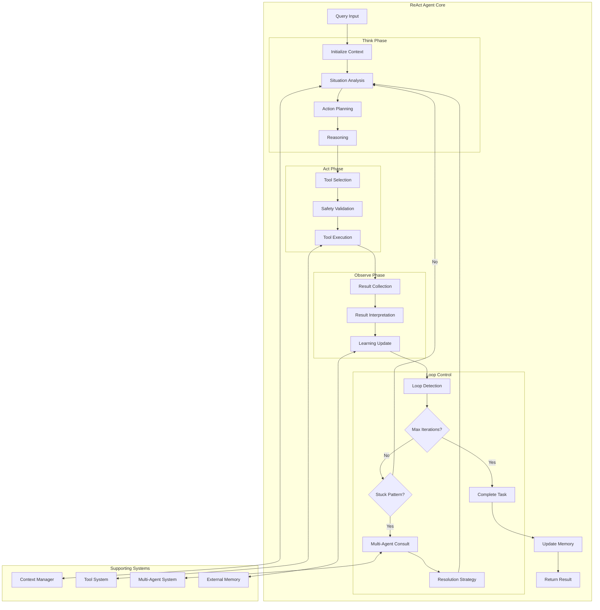

## 4. マルチエージェントシステムアーキテクチャ

### 4.1 協議システム構造

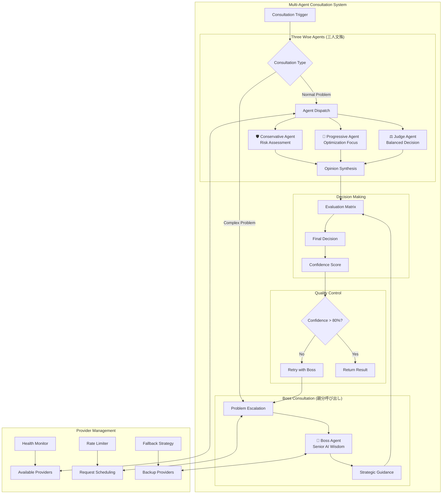

## 5. ツールシステムアーキテクチャ

### 5.1 安全性重視ツール実行

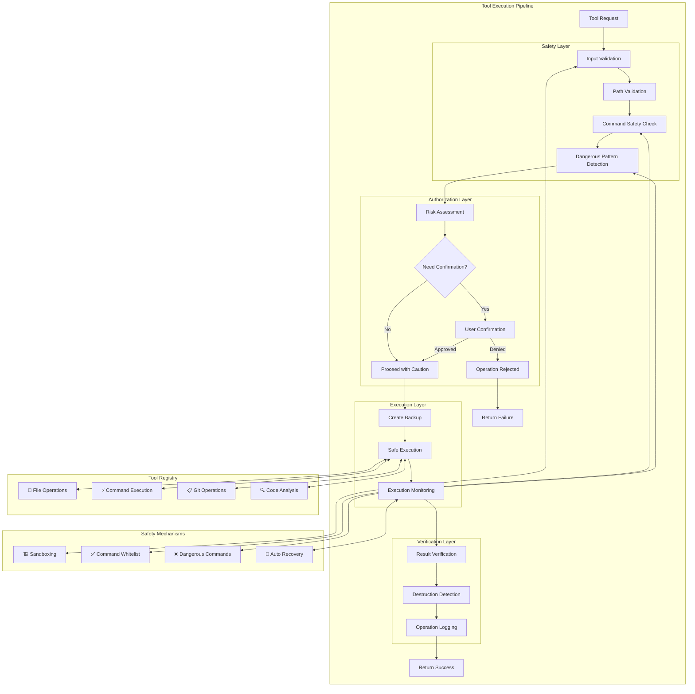

## 6. LLM統合アーキテクチャ

### 6.1 マルチプロバイダー通信システム

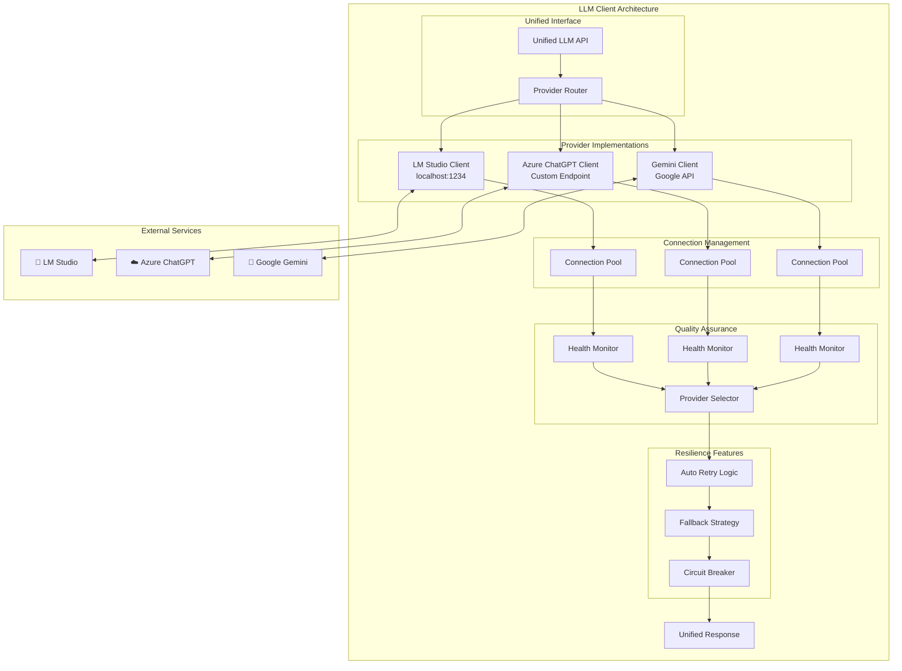

## 7. メモリシステムアーキテクチャ

### 7.1 外部メモリとコンテキスト管理

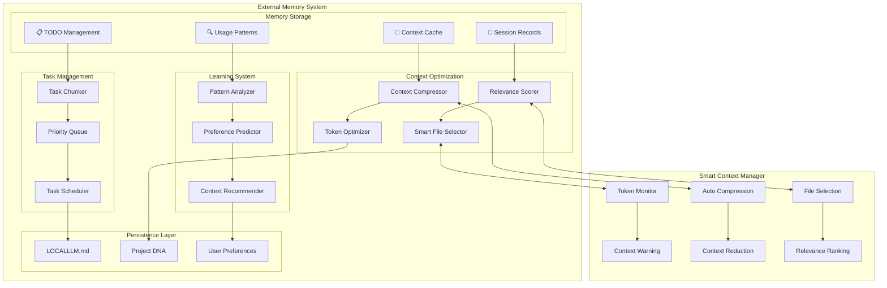

## 8. セキュリティアーキテクチャ

### 8.1 多層防御システム

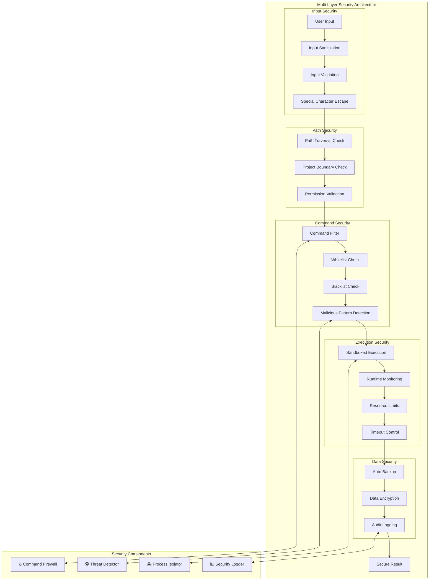

## 9. エラー処理とレジリエンスアーキテクチャ

### 9.1 包括的エラー処理システム

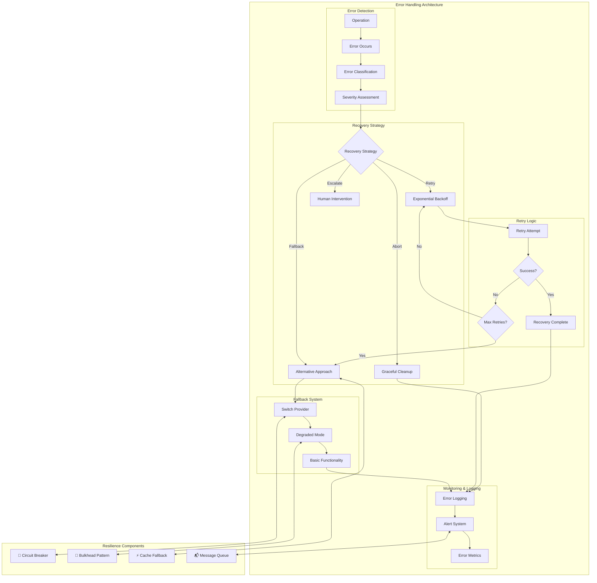

## 10. 配置とスケーラビリティ

### 10.1 システム配置アーキテクチャ

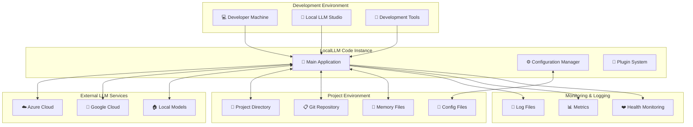

## 11. パフォーマンス最適化アーキテクチャ

### 11.1 性能最適化システム

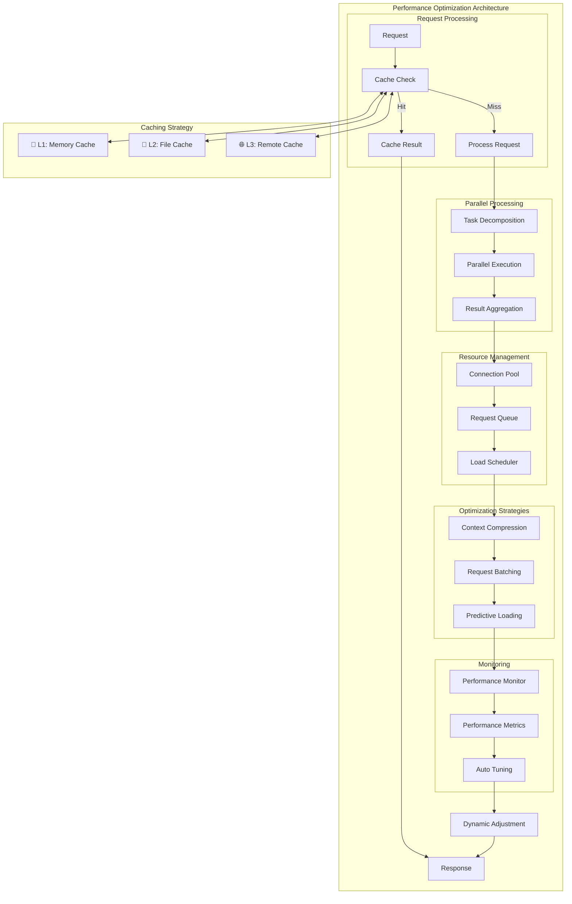

これらのアーキテクチャ図は、LocalLLM Code システムの包括的な設計と実装を視覚化しており、開発者がシステムの構造、データフロー、セキュリティ、パフォーマンス最適化を理解するのに役立ちます。