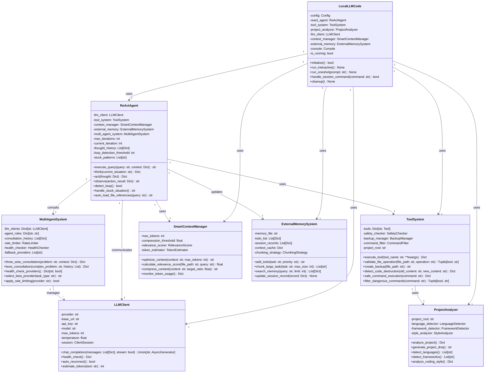
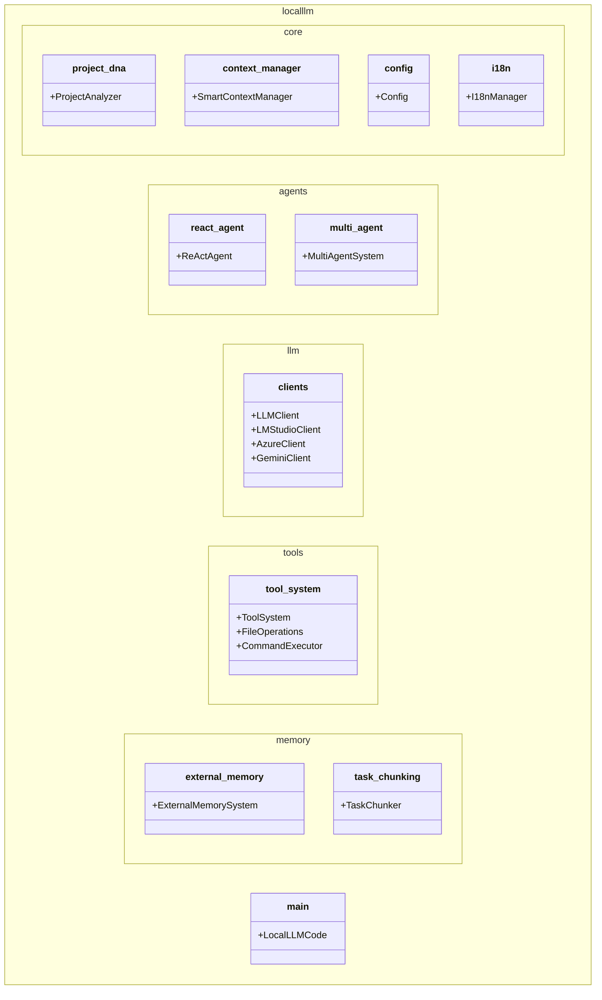
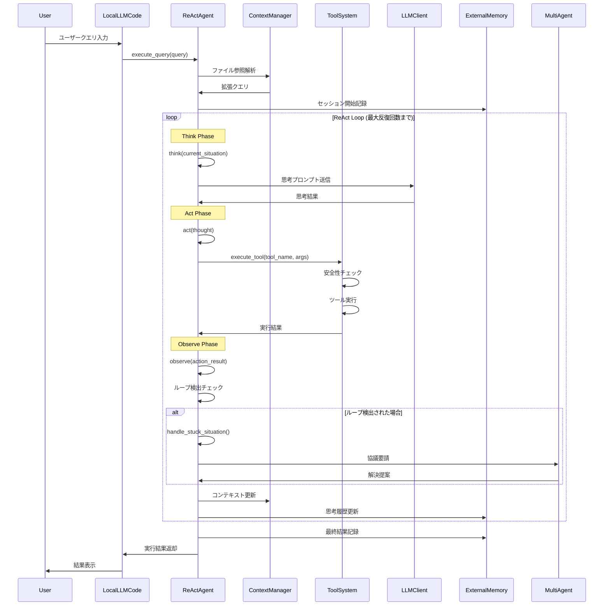
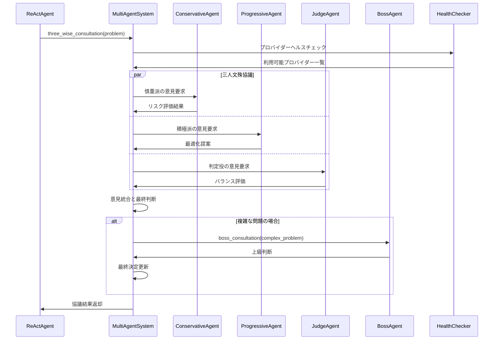
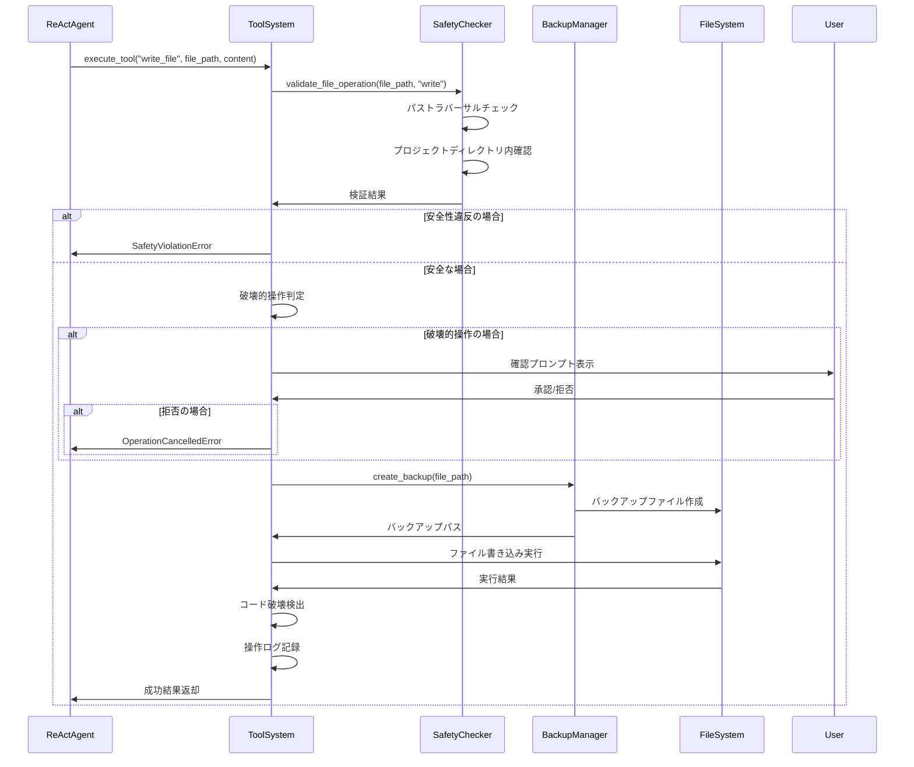
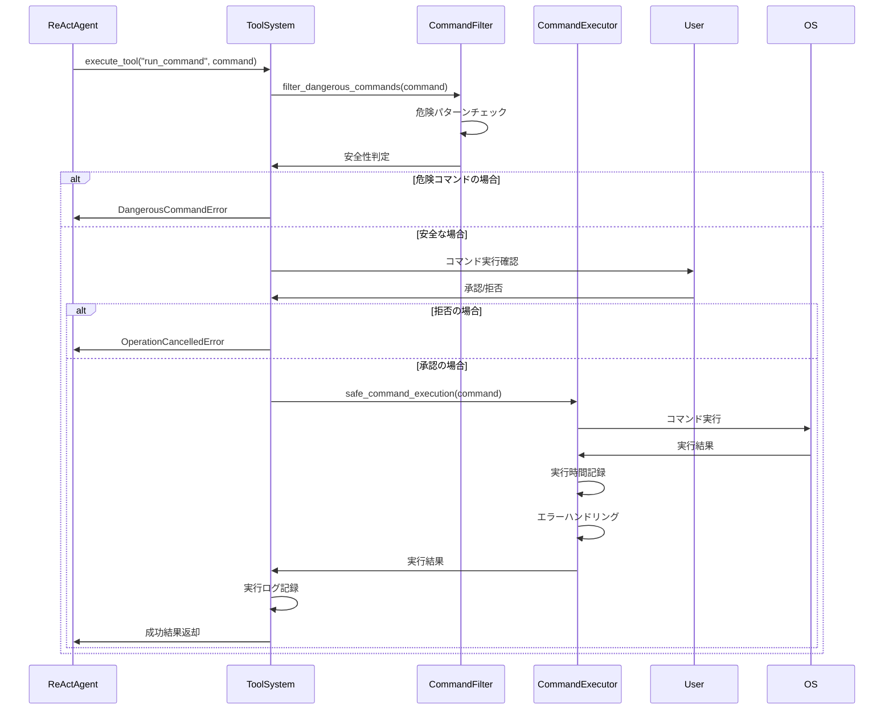
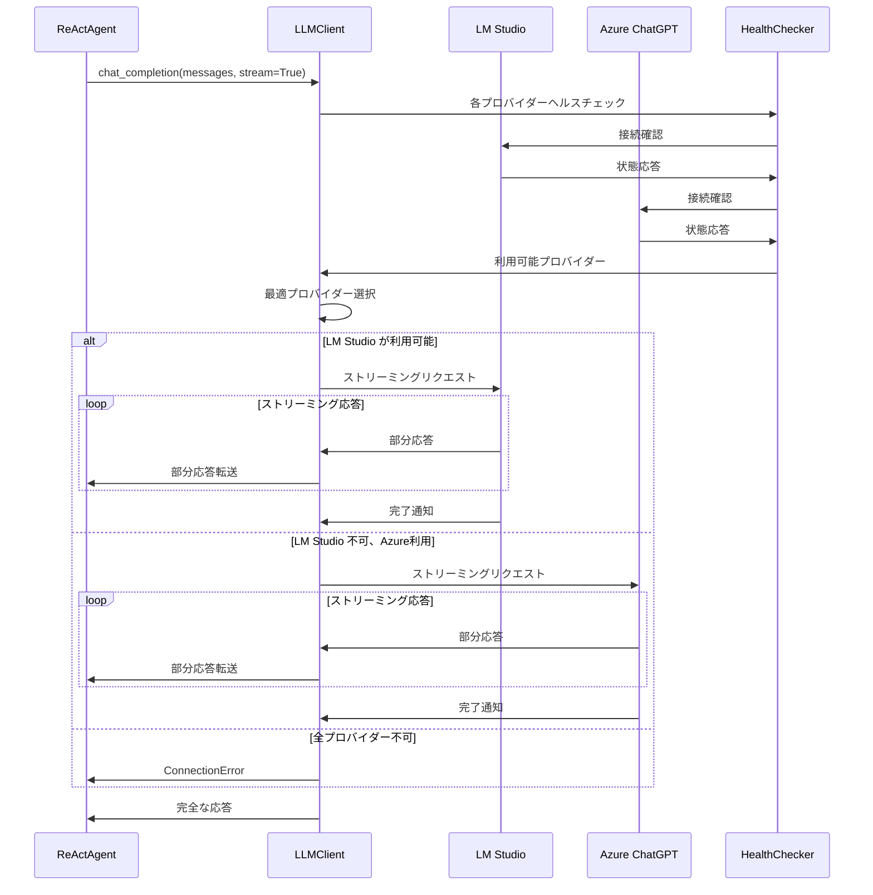
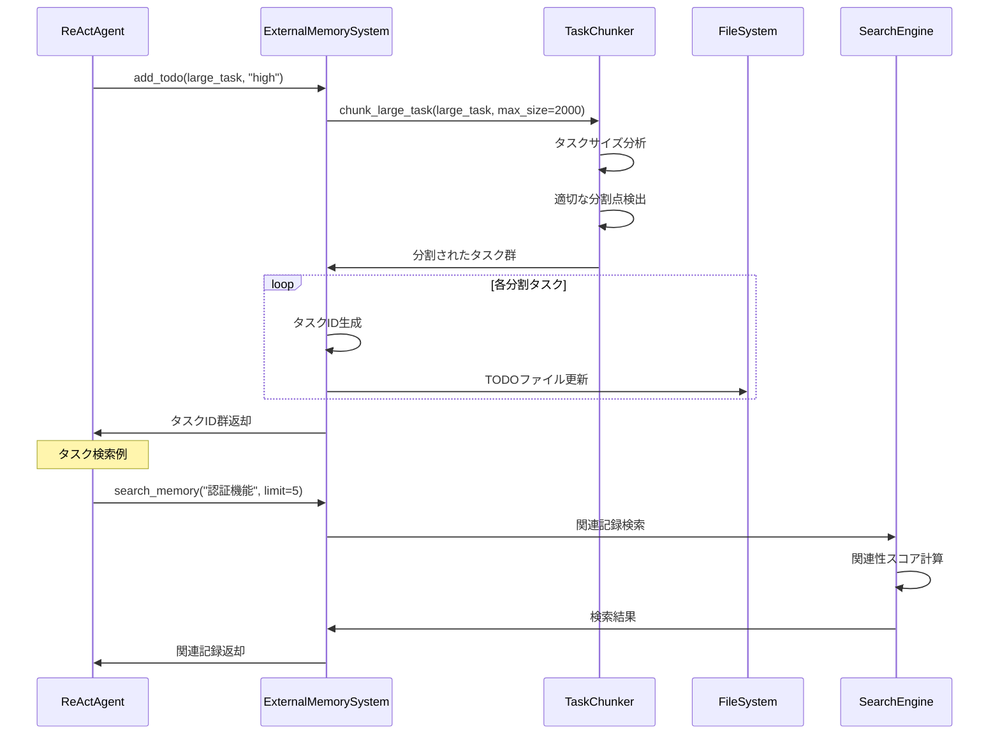
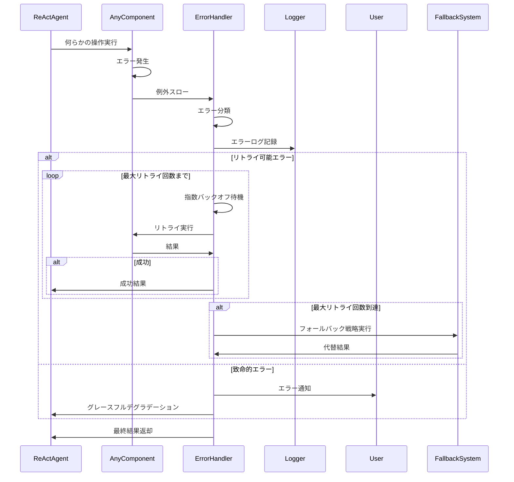
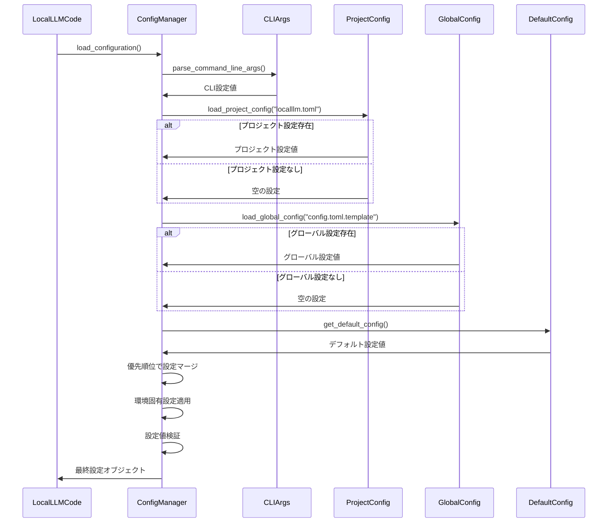

# LocalLLM Code クラス図とシーケンス図

## 1. 全体クラス図

### 1.1 コアシステムクラス図

## 2. パッケージ構造図

## 3. ReActエージェントシーケンス図

### 3.1 基本的なReActループ

### 3.2 マルチエージェント協議シーケンス

## 4. ツールシステム実行シーケンス

### 4.1 安全なファイル操作シーケンス

### 4.2 コマンド実行シーケンス

## 5. LLM通信シーケンス

### 5.1 マルチプロバイダーLLM通信

## 6. メモリシステムシーケンス

### 6.1 外部メモリ操作シーケンス

## 7. エラーハンドリングシーケンス

### 7.1 包括的エラー処理

## 8. 設定管理シーケンス

### 8.1 階層的設定ロード

これらの図表は、LocalLLM Code システムの動作を視覚的に理解するための包括的な設計ドキュメントです。各コンポーネント間の関係性、データフロー、エラーハンドリング、設定管理などの重要な側面を詳細に示しています。