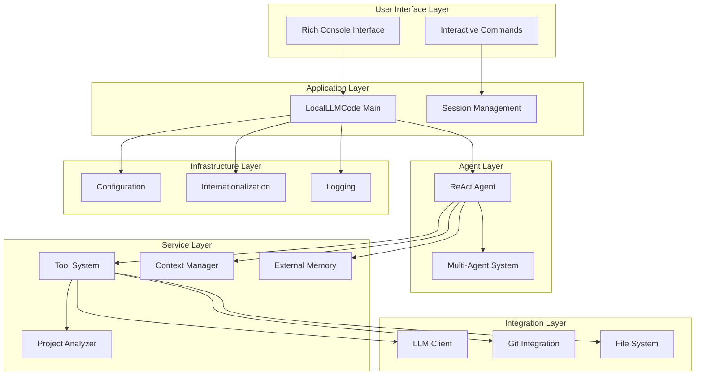
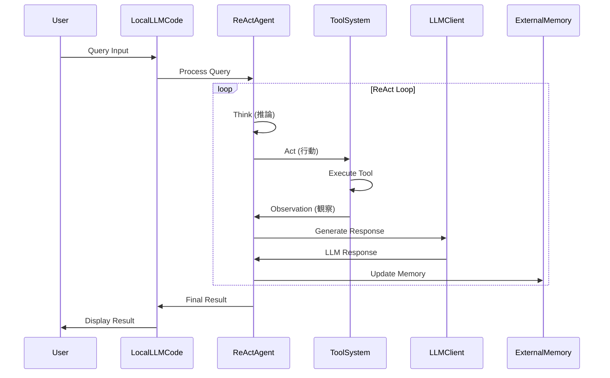
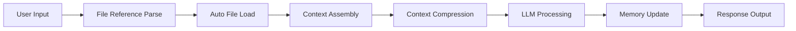
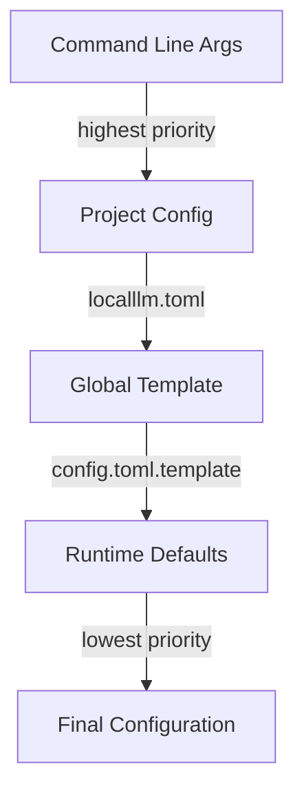
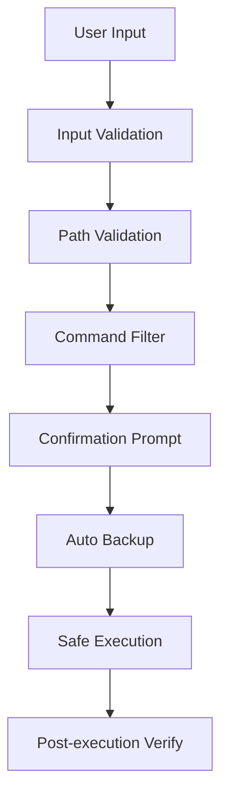

# LocalLLM Code 基本設計書

## 1. システム概要

### 1.1 プロジェクト概要
LocalLLM Code は、ローカルLLM（LM Studio）およびクラウドプロバイダー（Azure、Gemini）と連携する高度なエージェント型開発支援ツールです。ReAct（推論-行動-観察）ループを実装し、自然言語による対話を通じてプロジェクト構造の理解、コード解析、ファイル操作などの開発タスクを自動化します。

### 1.2 主要特徴
- **ReAct エージェントシステム**: 思考→行動→観察のループによる自律的タスク実行
- **マルチエージェント協調**: 複数のAIエージェントによる協議と意思決定
- **プロジェクトDNA解析**: プロジェクト構造、言語、フレームワークの自動分析
- **スマートコンテキスト管理**: トークン制限に応じた動的コンテキスト最適化
- **外部メモリシステム**: 永続的なタスク管理とセッション記録
- **マルチプロバイダーLLM対応**: LM Studio、Azure、Geminiの統一インターフェース
- **安全性重視設計**: 包括的な安全機能と確認機能

### 1.3 システム目標
1. 開発者の生産性向上
2. プロジェクト理解の自動化
3. 安全で信頼性の高いコード操作
4. 直感的な自然言語インターフェース
5. 拡張性とカスタマイズ性

## 2. システムアーキテクチャ

### 2.1 全体アーキテクチャ

### 2.2 レイヤー構成

#### ユーザーインターフェースレイヤー
- **Rich Console Interface**: 高度なターミナルUI
- **Interactive Commands**: セッション管理コマンド（/help, /status, /memory等）

#### アプリケーションレイヤー
- **LocalLLMCode Main**: メインアプリケーションオーケストレーター
- **Session Management**: セッション状態とライフサイクル管理

#### エージェントレイヤー
- **ReAct Agent**: 推論-行動-観察ループの実装
- **Multi-Agent System**: 複数エージェントによる協議システム

#### サービスレイヤー
- **Tool System**: 安全なファイル操作とシステム統合
- **Context Manager**: 知的コンテキスト最適化
- **External Memory**: 永続的メモリとタスク管理
- **Project Analyzer**: プロジェクトDNA解析

#### インテグレーションレイヤー
- **LLM Client**: マルチプロバイダーLLM通信
- **Git Integration**: バージョン管理システム統合
- **File System**: 安全なファイルシステム操作

#### インフラストラクチャレイヤー
- **Configuration**: 階層的設定管理
- **Internationalization**: 多言語対応（日本語/英語）
- **Logging**: システムログとデバッグ

## 3. 主要コンポーネント

### 3.1 LocalLLMCode（メインアプリケーション）
- **ファイル**: `main.py:54-442`
- **役割**: システム全体のオーケストレーション
- **主要機能**:
  - 初期化と設定管理
  - インタラクティブモード処理
  - セッションコマンド実行
  - クリーンアップとライフサイクル管理

### 3.2 ReActAgent（ReActエージェント）
- **ファイル**: `localllm/agents/react_agent.py:33-731`
- **役割**: 核となる推論-行動-観察ループ
- **主要機能**:
  - ReAct手法によるクエリ実行
  - ループ検出とスタック状況ハンドリング
  - ファイル参照自動解析とロード
  - コンテキスト圧縮と管理

### 3.3 MultiAgentSystem（マルチエージェントシステム）
- **ファイル**: `localllm/agents/multi_agent.py:35-387`
- **役割**: マルチエージェント協調と協議
- **主要機能**:
  - 三人文殊協議システム
  - 親分呼び出しシステム
  - プロバイダー管理とヘルスチェック
  - レート制限とエラーハンドリング

### 3.4 ToolSystem（ツールシステム）
- **ファイル**: `localllm/tools/tool_system.py:26-1357`
- **役割**: 安全なファイル操作とシステム相互作用
- **主要機能**:
  - セーフティチェック付きファイルCRUD操作
  - セキュリティフィルター付きコマンド実行
  - コード解析と改善提案
  - Git統合

## 4. データフロー

### 4.1 基本フロー

### 4.2 コンテキスト管理フロー

## 5. 設定管理

### 5.1 階層的設定システム

### 5.2 設定カテゴリー
- **OS固有設定**: シェル、コマンド、パス区切り文字の自動検出
- **LLM設定**: プロバイダー固有設定と認証情報
- **安全設定**: 確認プロンプト、危険コマンドフィルタリング
- **メモリ設定**: クリーンアップポリシー、記録制限
- **コンテキスト管理**: トークン制限、圧縮閾値

## 6. セキュリティ設計

### 6.1 安全機能
1. **パス検証**: プロジェクトディレクトリへの操作制限
2. **コマンドフィルタリング**: 危険なシェルコマンドのブロック
3. **確認プロンプト**: 破壊的操作のユーザー承認
4. **自動バックアップ**: 編集前の`.backup`ファイル作成
5. **コード破壊検出**: 高度なパターン認識
6. **ファイル操作検証**: 実行前安全チェック

### 6.2 セキュリティアーキテクチャ

## 7. 拡張性設計

### 7.1 プラグインアーキテクチャ
- **ツール拡張**: 新しいツールの動的追加
- **LLMプロバイダー拡張**: 新しいLLMサービスの統合
- **言語拡張**: 新しいプログラミング言語サポート

### 7.2 設定駆動型機能
- **実験的機能**: フィーチャーフラグによる機能制御
- **カスタムコマンド**: エイリアスとマクロ定義
- **プロジェクト固有設定**: プロジェクトレベルのカスタマイズ

## 8. パフォーマンス設計

### 8.1 最適化戦略
- **スマートコンテキスト管理**: 動的トークン最適化
- **非同期処理**: aiohttp による非同期LLM通信
- **キャッシュ機能**: 頻繁にアクセスされるデータのキャッシュ
- **遅延読み込み**: 必要時のみファイル読み込み

### 8.2 リソース管理
- **メモリ管理**: 大きなファイルの効率的処理
- **コンテキスト圧縮**: 自動的なコンテキストサイズ制御
- **接続プール**: LLMプロバイダーとの効率的な通信

## 9. 運用設計

### 9.1 監視とログ
- **構造化ログ**: 詳細な操作ログとエラートラッキング
- **ヘルスチェック**: LLMプロバイダーの状態監視
- **パフォーマンス監視**: レスポンス時間とトークン使用量

### 9.2 エラーハンドリング
- **グレースフルデグラデーション**: サービス障害時の代替処理
- **自動リトライ**: ネットワークエラーの自動復旧
- **詳細エラー報告**: 問題診断のための詳細情報

## 10. 今後の拡張計画

### 10.1 短期計画
- **追加LLMプロバイダー**: Claude、GPT-4等の対応
- **GUI インターフェース**: Web UI の実装
- **プラグインシステム**: サードパーティ拡張対応

### 10.2 中長期計画
- **クラウド統合**: クラウドベースの協調作業
- **AI学習機能**: ユーザー固有の学習と適応
- **企業統合**: 企業システムとの統合機能

この基本設計書は、LocalLLM Code の全体的なアーキテクチャ、主要コンポーネント、および設計思想を包括的に説明しています。システムの理解と今後の開発に活用してください。