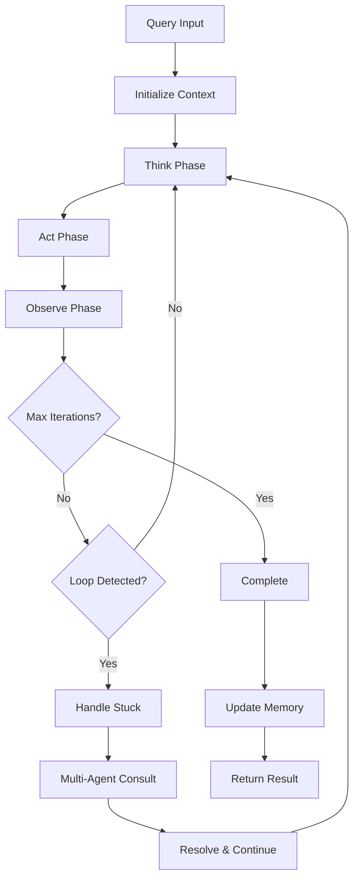
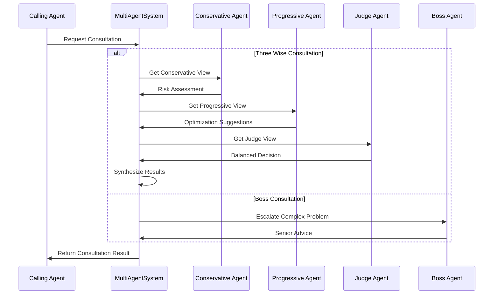
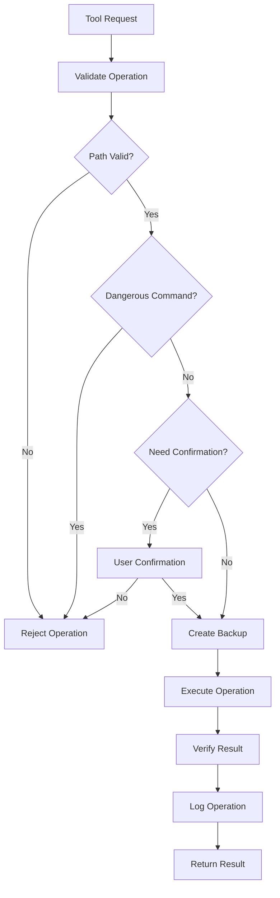
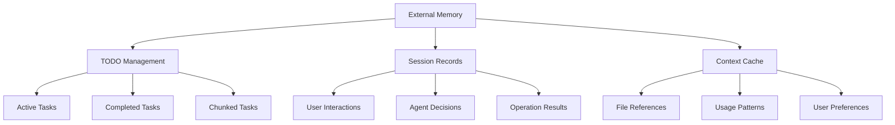
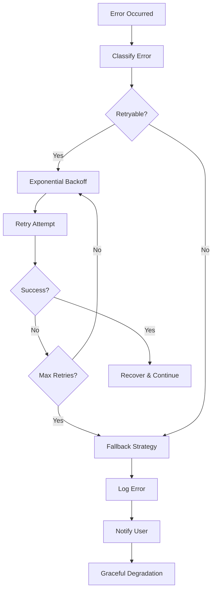

# LocalLLM Code 詳細設計書

## 1. クラス設計詳細

### 1.1 LocalLLMCode（メインアプリケーションクラス）

**ファイル**: `main.py:54-442`

#### クラス仕様
```python
class LocalLLMCode:
    """
    メインアプリケーションクラス
    システム全体のオーケストレーションと初期化を担当
    """
```

#### 属性
| 属性名 | 型 | 説明 |
|--------|----|----|
| config | Config | 設定管理オブジェクト |
| react_agent | ReActAgent | ReActエージェントインスタンス |
| tool_system | ToolSystem | ツールシステムインスタンス |
| project_analyzer | ProjectAnalyzer | プロジェクト解析器 |
| llm_client | LLMClient | LLM通信クライアント |
| context_manager | SmartContextManager | コンテキスト管理器 |
| external_memory | ExternalMemorySystem | 外部メモリシステム |
| console | Console | Richコンソールオブジェクト |
| is_running | bool | 実行状態フラグ |

#### 主要メソッド

```python
async def initialize(self) -> bool:
    """
    システム初期化
    - 設定ロード
    - LLM接続確認
    - プロジェクト解析
    - エージェント初期化
    
    Returns:
        bool: 初期化成功フラグ
    """

async def run_interactive(self) -> None:
    """
    インタラクティブモード実行
    - ユーザー入力受付
    - セッションコマンド処理
    - ReActエージェント呼び出し
    """

async def run_oneshot(self, prompt: str) -> None:
    """
    ワンショットモード実行
    
    Args:
        prompt: 実行するプロンプト
    """

async def handle_session_command(self, command: str) -> bool:
    """
    セッションコマンド処理
    
    Args:
        command: 入力されたコマンド
        
    Returns:
        bool: コマンド処理結果
    """

async def cleanup(self) -> None:
    """
    システムクリーンアップ
    - メモリクリーンアップ
    - 設定保存
    - リソース解放
    """
```

#### 設計パターン
- **Facade Pattern**: 複雑なサブシステムへの統一インターフェース
- **Factory Pattern**: コンポーネントの動的生成
- **Observer Pattern**: 設定変更の監視

---

### 1.2 ReActAgent（ReActエージェントクラス）

**ファイル**: `localllm/agents/react_agent.py:33-731`

#### クラス仕様
```python
class ReActAgent:
    """
    ReAct（推論-行動-観察）ループを実装するエージェントクラス
    思考→行動→観察のサイクルによる自律的タスク実行
    """
```

#### 属性
| 属性名 | 型 | 説明 |
|--------|----|----|
| llm_client | LLMClient | LLM通信クライアント |
| tool_system | ToolSystem | 利用可能ツールシステム |
| context_manager | SmartContextManager | コンテキスト管理器 |
| external_memory | ExternalMemorySystem | 外部メモリシステム |
| multi_agent_system | MultiAgentSystem | マルチエージェントシステム |
| max_iterations | int | 最大反復回数 |
| current_iteration | int | 現在の反復回数 |
| thought_history | List[Dict] | 思考履歴 |
| loop_detection_threshold | int | ループ検出閾値 |
| stuck_patterns | List[str] | スタックパターン定義 |

#### 主要メソッド

```python
async def execute_query(self, query: str, context: Dict = None) -> str:
    """
    ReActループによるクエリ実行
    
    Args:
        query: 実行クエリ
        context: 追加コンテキスト
        
    Returns:
        str: 実行結果
    """

async def think(self, current_situation: str) -> Dict:
    """
    思考フェーズ（Think）
    現在の状況を分析し、次の行動を決定
    
    Args:
        current_situation: 現在の状況
        
    Returns:
        Dict: 思考結果（行動計画、理由など）
    """

async def act(self, thought: Dict) -> Dict:
    """
    行動フェーズ（Act）
    決定された行動を実行
    
    Args:
        thought: 思考結果
        
    Returns:
        Dict: 行動結果
    """

async def observe(self, action_result: Dict) -> str:
    """
    観察フェーズ（Observe）
    行動結果を観察し、次の思考に向けた情報を整理
    
    Args:
        action_result: 行動結果
        
    Returns:
        str: 観察結果
    """

def detect_loop(self) -> bool:
    """
    ループ検出
    同じパターンの繰り返しを検出
    
    Returns:
        bool: ループ検出フラグ
    """

async def handle_stuck_situation(self) -> str:
    """
    スタック状況ハンドリング
    ループまたはスタック状況の解決
    
    Returns:
        str: 解決策
    """

async def auto_load_file_references(self, query: str) -> str:
    """
    ファイル参照自動ロード
    @filename パターンを検出してファイルを自動ロード
    
    Args:
        query: 元クエリ
        
    Returns:
        str: ファイル内容を含む拡張クエリ
    """
```

#### ReActループフロー



---

### 1.3 MultiAgentSystem（マルチエージェントシステム）

**ファイル**: `localllm/agents/multi_agent.py:35-387`

#### クラス仕様
```python
class MultiAgentSystem:
    """
    複数のAIエージェントによる協議と意思決定システム
    三人文殊（3人の賢者）と親分呼び出しシステムを実装
    """
```

#### 属性
| 属性名 | 型 | 説明 |
|--------|----|----|
| llm_clients | Dict[str, LLMClient] | LLMクライアント群 |
| agent_roles | Dict[str, str] | エージェントロール定義 |
| consultation_history | List[Dict] | 協議履歴 |
| rate_limiter | RateLimiter | レート制限管理 |
| health_checker | HealthChecker | ヘルスチェック管理 |
| fallback_providers | List[str] | フォールバックプロバイダー |

#### エージェントロール

```python
AGENT_ROLES = {
    "conservative": {
        "name": "慎重派エージェント",
        "personality": "リスクを重視し、安全性を最優先に考える",
        "focus": "問題点の指摘、リスク評価、慎重な提案"
    },
    "progressive": {
        "name": "積極派エージェント", 
        "personality": "機会を重視し、効率性を最優先に考える",
        "focus": "改善提案、最適化、新しいアプローチ"
    },
    "judge": {
        "name": "判定エージェント",
        "personality": "バランスを重視し、客観的に判断する",
        "focus": "総合評価、最終判断、調整案の提示"
    },
    "boss": {
        "name": "親分エージェント",
        "personality": "経験豊富で包括的な視点を持つ上級AI",
        "focus": "複雑な問題の解決、戦略的判断、最終決定"
    }
}
```

#### 主要メソッド

```python
async def three_wise_consultation(self, problem: str, context: Dict = None) -> Dict:
    """
    三人文殊協議
    3つの異なる視点からの意見を収集し、最適解を導出
    
    Args:
        problem: 協議対象の問題
        context: 追加コンテキスト
        
    Returns:
        Dict: 協議結果（各エージェントの意見、最終判断）
    """

async def boss_consultation(self, complex_problem: str, consultation_history: List = None) -> Dict:
    """
    親分呼び出し
    複雑な問題に対する上級AIからの助言
    
    Args:
        complex_problem: 複雑な問題
        consultation_history: 過去の協議履歴
        
    Returns:
        Dict: 親分からの助言
    """

async def health_check_providers(self) -> Dict[str, bool]:
    """
    プロバイダーヘルスチェック
    
    Returns:
        Dict[str, bool]: プロバイダー別健康状態
    """

async def select_best_provider(self, task_type: str = None) -> str:
    """
    最適プロバイダー選択
    
    Args:
        task_type: タスクタイプ
        
    Returns:
        str: 選択されたプロバイダー名
    """

def apply_rate_limiting(self, provider: str) -> bool:
    """
    レート制限適用
    
    Args:
        provider: プロバイダー名
        
    Returns:
        bool: 実行可能フラグ
    """
```

#### 協議フロー



---

### 1.4 ToolSystem（ツールシステム）

**ファイル**: `localllm/tools/tool_system.py:26-1357`

#### クラス仕様
```python
class ToolSystem:
    """
    安全なファイル操作とシステム相互作用を提供するツールシステム
    包括的な安全機能と確認機能を実装
    """
```

#### 利用可能ツール

| ツール名 | 機能 | 安全性レベル |
|----------|------|-------------|
| read_file | ファイル読み取り | 安全 |
| write_file | ファイル書き込み | 高リスク |
| edit_file | ファイル編集 | 高リスク |
| create_file | ファイル作成 | 中リスク |
| list_files | ファイル一覧 | 安全 |
| search_files | ファイル検索 | 安全 |
| run_command | コマンド実行 | 最高リスク |
| git_status | Git状態確認 | 安全 |
| git_commit | Gitコミット | 中リスク |
| analyze_code | コード解析 | 安全 |

#### 主要メソッド

```python
async def execute_tool(self, tool_name: str, **kwargs) -> Dict:
    """
    ツール実行のメインエントリーポイント
    
    Args:
        tool_name: 実行するツール名
        **kwargs: ツール固有の引数
        
    Returns:
        Dict: 実行結果
    """

def validate_file_operation(self, file_path: str, operation: str) -> Tuple[bool, str]:
    """
    ファイル操作の安全性検証
    
    Args:
        file_path: 対象ファイルパス
        operation: 操作種別
        
    Returns:
        Tuple[bool, str]: (検証結果, エラーメッセージ)
    """

def create_backup(self, file_path: str) -> str:
    """
    ファイルバックアップ作成
    
    Args:
        file_path: バックアップ対象ファイル
        
    Returns:
        str: バックアップファイルパス
    """

def detect_code_destruction(self, old_content: str, new_content: str) -> Dict:
    """
    コード破壊検出
    
    Args:
        old_content: 元のコンテンツ
        new_content: 新しいコンテンツ
        
    Returns:
        Dict: 破壊検出結果
    """

async def safe_command_execution(self, command: str) -> Dict:
    """
    安全なコマンド実行
    
    Args:
        command: 実行コマンド
        
    Returns:
        Dict: 実行結果
    """

def filter_dangerous_commands(self, command: str) -> Tuple[bool, str]:
    """
    危険コマンドフィルタリング
    
    Args:
        command: チェック対象コマンド
        
    Returns:
        Tuple[bool, str]: (安全フラグ, 理由)
    """
```

#### 安全性チェックフロー



---

### 1.5 LLMClient（LLM通信クライアント）

**ファイル**: `localllm/llm/clients.py:17-366`

#### クラス仕様
```python
class LLMClient:
    """
    マルチプロバイダーLLM通信の統一インターフェース
    LM Studio、Azure、Geminiに対応
    """
```

#### サポートプロバイダー

| プロバイダー | URL | 認証方式 | ストリーミング |
|-------------|-----|----------|---------------|
| LM Studio | localhost:1234 | なし | 対応 |
| Azure | カスタムエンドポイント | API Key | 対応 |
| Gemini | Google API | API Key | 対応 |

#### 主要メソッド

```python
async def chat_completion(self, messages: List[Dict], stream: bool = True) -> Union[str, AsyncGenerator]:
    """
    チャット補完実行
    
    Args:
        messages: メッセージ履歴
        stream: ストリーミングフラグ
        
    Returns:
        Union[str, AsyncGenerator]: レスポンス
    """

async def health_check(self) -> Dict:
    """
    プロバイダーヘルスチェック
    
    Returns:
        Dict: ヘルス状態
    """

async def auto_reconnect(self) -> bool:
    """
    自動再接続
    
    Returns:
        bool: 再接続成功フラグ
    """

def estimate_tokens(self, text: str) -> int:
    """
    トークン数推定
    
    Args:
        text: 対象テキスト
        
    Returns:
        int: 推定トークン数
    """
```

---

### 1.6 SmartContextManager（スマートコンテキスト管理）

**ファイル**: `localllm/core/context_manager.py:26-336`

#### クラス仕様
```python
class SmartContextManager:
    """
    知的コンテキスト最適化
    トークン制限に応じた動的コンテキスト管理
    """
```

#### 主要メソッド

```python
def optimize_context(self, context: str, max_tokens: int) -> str:
    """
    コンテキスト最適化
    
    Args:
        context: 元コンテキスト
        max_tokens: 最大トークン数
        
    Returns:
        str: 最適化されたコンテキスト
    """

def calculate_relevance_score(self, file_path: str, query: str) -> float:
    """
    ファイル関連性スコア計算
    
    Args:
        file_path: ファイルパス
        query: クエリ
        
    Returns:
        float: 関連性スコア
    """

def compress_content(self, content: str, target_ratio: float = 0.5) -> str:
    """
    コンテンツ圧縮
    
    Args:
        content: 元コンテンツ
        target_ratio: 目標圧縮率
        
    Returns:
        str: 圧縮されたコンテンツ
    """
```

---

### 1.7 ExternalMemorySystem（外部メモリシステム）

**ファイル**: `localllm/memory/external_memory.py:26-471`

#### クラス仕様
```python
class ExternalMemorySystem:
    """
    永続的メモリとタスク管理システム
    セッション間でのコンテキスト保持と効率的なタスク分割
    """
```

#### メモリ構造



#### 主要メソッド

```python
async def add_todo(self, task: str, priority: str = "medium") -> str:
    """
    TODO追加
    
    Args:
        task: タスク内容
        priority: 優先度
        
    Returns:
        str: タスクID
    """

async def chunk_large_task(self, task: str, max_size: int = 2000) -> List[str]:
    """
    大きなタスクの分割
    
    Args:
        task: 元タスク
        max_size: 最大サイズ
        
    Returns:
        List[str]: 分割されたタスク群
    """

async def search_memory(self, query: str, limit: int = 10) -> List[Dict]:
    """
    メモリ検索
    
    Args:
        query: 検索クエリ
        limit: 結果数制限
        
    Returns:
        List[Dict]: 検索結果
    """
```

---

## 2. データベース設計

### 2.1 設定ファイル構造（TOML）

```toml
# localllm.toml
[llm]
provider = "lmstudio"  # lmstudio, azure, gemini
model = "llama3"
max_tokens = 8192
temperature = 0.1

[llm.lmstudio]
base_url = "http://localhost:1234"
timeout = 30

[llm.azure]
endpoint = ""
api_key = ""
deployment_name = ""

[safety]
require_confirmation = true
auto_backup = true
dangerous_commands = ["rm -rf", "format", "del /s"]

[project]
include_patterns = ["*.py", "*.js", "*.ts", "*.md"]
exclude_patterns = ["node_modules", "__pycache__", ".git"]
memory_file = "LOCALLLM.md"

[commands.aliases]
analyze = "プロジェクトを解析してください"
optimize = "コードを最適化してください"
```

### 2.2 メモリファイル構造（LOCALLLM.md）

```markdown
# Project Memory

## プロジェクトDNA
- 言語: Python 3.11
- フレームワーク: FastAPI, React
- アーキテクチャ: マイクロサービス
- 主要ライブラリ: SQLAlchemy, Redis

## ディレクトリ構造
/api - API層
/models - データモデル
/services - ビジネスロジック
/tests - テストコード

## コーディングスタイル
- PEP8準拠
- Type hints必須
- Docstring: Google Style

## TODO履歴
- [完了] ユーザー認証機能実装
- [進行中] API最適化
- [予定] フロントエンド刷新
```

---

## 3. API設計

### 3.1 ツールAPI仕様

#### ファイル操作API

```python
# read_file
{
    "tool": "read_file",
    "args": {
        "file_path": "src/main.py",
        "encoding": "utf-8"
    }
}

# Response
{
    "success": True,
    "content": "ファイル内容",
    "metadata": {
        "size": 1024,
        "modified": "2024-01-01T12:00:00",
        "encoding": "utf-8"
    }
}
```

#### コマンド実行API

```python
# run_command
{
    "tool": "run_command", 
    "args": {
        "command": "python -m pytest",
        "working_dir": "/project",
        "timeout": 30
    }
}

# Response
{
    "success": True,
    "stdout": "テスト結果",
    "stderr": "",
    "return_code": 0,
    "execution_time": 2.5
}
```

### 3.2 LLM API仕様

#### チャット補完API

```python
# Request
{
    "messages": [
        {"role": "system", "content": "システムプロンプト"},
        {"role": "user", "content": "ユーザー入力"}
    ],
    "stream": True,
    "max_tokens": 2048,
    "temperature": 0.1
}

# Response (Streaming)
{
    "choices": [
        {
            "delta": {"content": "レスポンス部分"},
            "finish_reason": None
        }
    ]
}
```

---

## 4. エラーハンドリング設計

### 4.1 エラー分類

```python
class LocalLLMError(Exception):
    """基底例外クラス"""
    pass

class ConfigurationError(LocalLLMError):
    """設定関連エラー"""
    pass

class LLMConnectionError(LocalLLMError):
    """LLM接続エラー"""
    pass

class ToolExecutionError(LocalLLMError):
    """ツール実行エラー"""
    pass

class SafetyViolationError(LocalLLMError):
    """安全性違反エラー"""
    pass
```

### 4.2 エラー処理フロー



---

## 5. パフォーマンス最適化

### 5.1 キャッシュ戦略

```python
class CacheManager:
    """キャッシュ管理システム"""
    
    def __init__(self):
        self.file_cache = TTLCache(maxsize=100, ttl=300)  # 5分
        self.analysis_cache = TTLCache(maxsize=50, ttl=600)  # 10分
        self.llm_cache = TTLCache(maxsize=200, ttl=1800)  # 30分
```

### 5.2 非同期処理設計

```python
async def parallel_file_analysis(self, file_paths: List[str]) -> Dict:
    """並列ファイル解析"""
    tasks = [self.analyze_file(path) for path in file_paths]
    results = await asyncio.gather(*tasks, return_exceptions=True)
    return self.merge_analysis_results(results)
```

---

## 6. セキュリティ詳細設計

### 6.1 入力検証

```python
def validate_file_path(self, path: str) -> bool:
    """ファイルパス検証"""
    # パストラバーサル攻撃防止
    if ".." in path or path.startswith("/"):
        return False
    
    # プロジェクトディレクトリ内確認
    abs_path = os.path.abspath(path)
    project_root = os.path.abspath(self.project_root)
    return abs_path.startswith(project_root)
```

### 6.2 コマンド実行制限

```python
DANGEROUS_COMMANDS = [
    r"rm\s+-rf",          # 再帰削除
    r"format\s+[a-z]:",   # ディスクフォーマット
    r"del\s+/s",          # Windows一括削除
    r"sudo\s+",           # 管理者権限
    r"chmod\s+777",       # 権限変更
]

def is_command_safe(self, command: str) -> Tuple[bool, str]:
    """コマンド安全性チェック"""
    for pattern in DANGEROUS_COMMANDS:
        if re.search(pattern, command, re.IGNORECASE):
            return False, f"危険なコマンドが検出されました: {pattern}"
    return True, ""
```

---

## 7. テスト設計

### 7.1 テスト構造

```
tests/
├── unit/                   # 単体テスト
│   ├── test_react_agent.py
│   ├── test_tool_system.py
│   └── test_llm_client.py
├── integration/            # 統合テスト
│   ├── test_full_workflow.py
│   └── test_multi_agent.py
└── e2e/                   # E2Eテスト
    └── test_interactive_session.py
```

### 7.2 テストケース例

```python
class TestReActAgent:
    """ReActエージェントテスト"""
    
    @pytest.mark.asyncio
    async def test_basic_query_execution(self):
        """基本的なクエリ実行テスト"""
        agent = ReActAgent(mock_llm_client, mock_tool_system)
        result = await agent.execute_query("ファイル一覧を表示してください")
        assert result.success
        assert "files" in result.data
    
    @pytest.mark.asyncio
    async def test_loop_detection(self):
        """ループ検出テスト"""
        agent = ReActAgent(mock_llm_client, mock_tool_system)
        # 同じパターンを繰り返すモックを設定
        with patch.object(agent, 'think') as mock_think:
            mock_think.return_value = {"action": "same_action"}
            result = await agent.execute_query("テストクエリ")
            assert agent.detect_loop()
```

この詳細設計書は、LocalLLM Code の実装レベルでの設計詳細を包括的に説明しています。各クラスの仕様、API設計、エラーハンドリング、パフォーマンス最適化、セキュリティ、テスト戦略まで網羅しており、実際の開発とメンテナンスに活用できます。